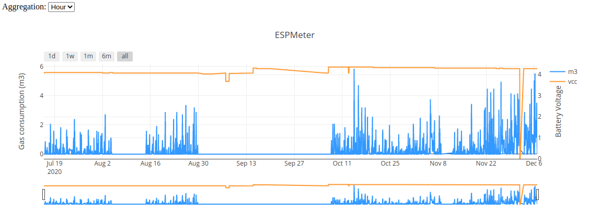
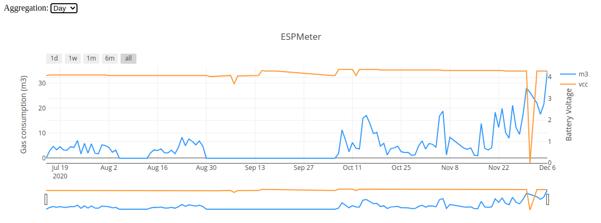
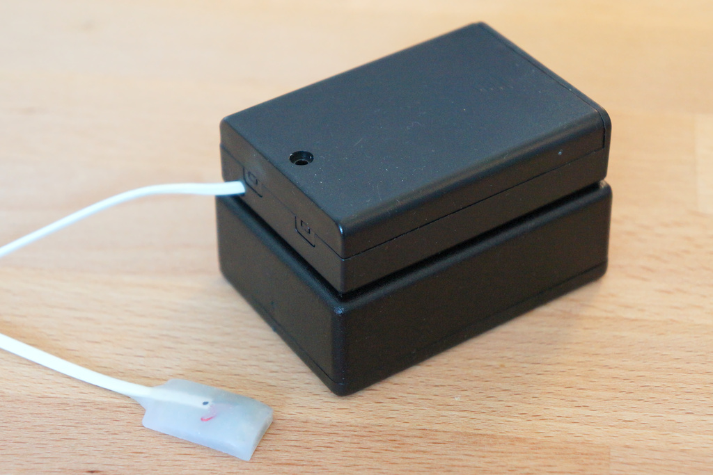
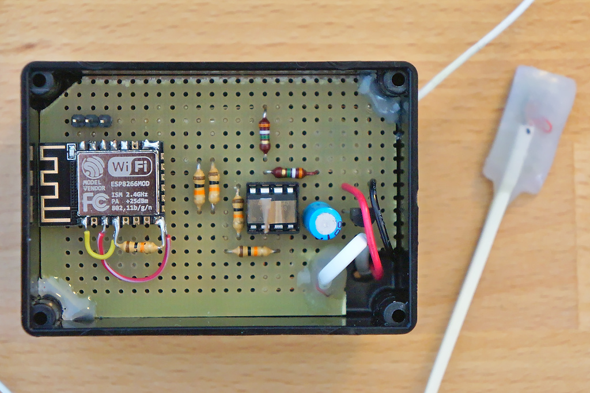
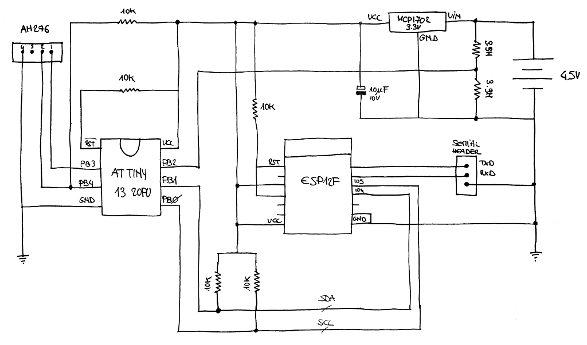
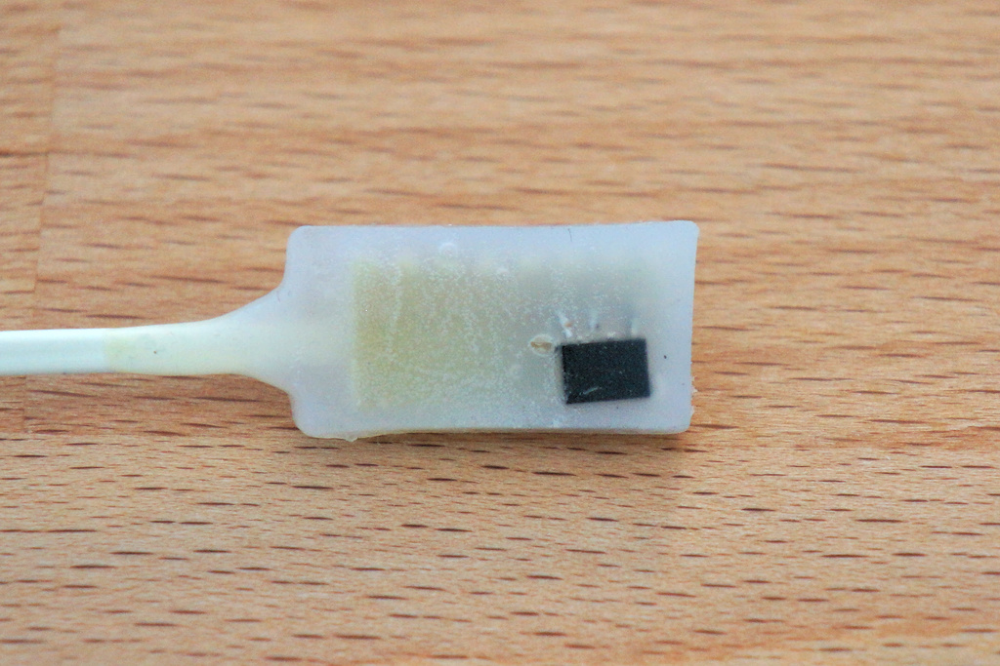
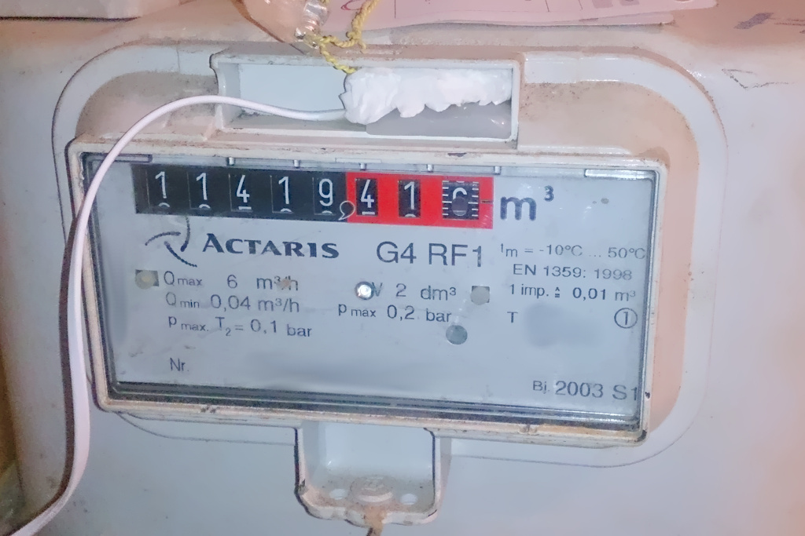

# ESPmeter

ESPmeter helps monitoring domestic gas consumption; a small device captures 
data from the gas meter which is then sent to a server via HTTP; a web 
application allows visualizing daily gas consumption with a granularity up to 
5 minutes.





## Operating principle

For this device to work, we need a type of mechanical gas meter having a magnet 
installed on one of the digits of its counter. A probe equipped with a Hall 
effect sensor is placed near or on top of the counter; the digit revolves when 
the gas flows and so does the magnet which becomes periodicaly detectable by 
the sensor. Keeping track of revolutions over time allows to calculate the 
amount of gas consumed during a certain period. 
While this project has been designed with gas meters in mind, it could 
theoretically work with other meters, such as water meters, as long as they 
have a detectable magnet moving along one of the indicators.



## Design

The device has been designed to be extremely easy to build, using a small number
of very common components. Particular attention has been put into energy
efficiency, trying to reduce consumption to the minimum to allow battery 
operation for (theoretically) more than a year. 

The ESP8266 power absorption is too high to be used to directly sample pulses
generated by the Hall effect sensor. Even using a Reed switch to wake-up the 
ESP at every pulse, consumption would be in the order of 15mA for the whole
ESP boot time + software sampling routine to run, assuming Wi-Fi being 
turned off from the start. This is too much to achieve battery life in the order
of years.

Instead, the ESP is coupled with an Tiny13, which takes care of the pulse 
recording part. The Tiny13 has a very low power consumption and can stay
asleep for most of the time. The ESP would then communicate with the Tiny13 
at regular intervals and then once per day would transmit data via Wi-Fi.



## Sampling frequency

Because we are using an Hall effect sensor and not a Reed switch, to be sure
the Tiny13 doesn't miss a pulse, the sensor has to be read often enough.

In my particular configuration, the digit carrying the magnet completes a 
revolution in less than 15 seconds (when I'm using both heater and kitchen stove
 at maximum power).

During this interval, the magnet is detectable by the sensor for about 1.5
seconds while being close enough to the sensor. 

Therefore setting the Tiny13 watchdog at 1Hz would ensure that the device is
woken up often enough so that it has time to power up the Hall sensor and detect
the presence of the magnet.

However, the larger the maximum gas flow that can be consumed, the faster the 
counter would spin, reducing the time the magnet is detectable by the sensor;
therefore depending on your meter model and your peak flow you may want to 
adjust this parameter in the code.

## Hardware



### Parts

* ATTiny13-20PU
* ESP-12F module
* MCP1702-3302ET low quiescent LDO regulator
* AH276 Hall effect sensor
* 10kΩ resistors (5x)
* 3.9MΩ resistors (2x) (see below)
* 10μF 10V capacitor
* perfboard
* 3 pin header (optional)
* 3 AA battery holder
* plastic enclosure
* 3 lead wire

### The probe

In my build, the Hall effect sensor has been salvaged from a common 12V PC fan. 
Maybe similar sensors can be used, but I've found this one to be quite reliable
in sensing the small magnet inside the meter. It is also drawing a very small 
amount of power and working well at 3.3V and below.



I've mounted the sensor on a small strip of perfboard, then soldered a decently 
looking wire so that the whole probe can be easily placed in the slot on top of 
the meter drums. I have embedded the probe into hot glue, then properly trimmed 
it to give it some sort of semi-professional look and providing good insulation
from humidity.

Below you can see the finished probe installed on my meter, temporarily hold in 
place with some paper. Note the small shiny magnet glued on top of the number 6 
in the last drum.



## Software on Tiny13 side:

Code is written in C and compiled via 
[avr-gcc](https://gcc.gnu.org/wiki/avr-gcc)

Most of time, the ATTiny is in sleep state. Internal timer is used to wake up
regularly, power the Hall effect sensor through one of the ATTiny pins and read
its output. The Tiny stores 3 hours of pulse counting in its own memory and 
it also regularly samples battery voltage every 3 hours. 

Communication with ESP is achieved via a simplified implementation of the I2C
protocol, derived from "AVR311: Using the TWI Module as I2C Slave" Atmel 
application note available [here](http://ww1.microchip.com/downloads/en/AppNotes/atmel-2565-using-the-twi-module-as-i2c-slave_applicationnote_avr311.pdf)

Battery voltage is fed through a voltage divider and compared with the 3.3V 
provided by the voltage regulator via the ADC. This is not very accurate but
it should be good enough to roughly estimate battery discharge rate. 

What it is sent to the ESP is contained in the following struct:

	typedef struct pulse_log_t {
		uint8_t checksum;
		uint8_t vcc;
		uint16_t ticks;
		uint8_t frames[LOG_FRAMES];
	} pulse_log_t;

* checksum is a simple modulo 256 of sum of the other bytes of the struct
* vcc is updated every 3 hours and it's the output of the ADC used to measure
battery voltage (see below)
* ticks is the number of seconds since last communication with the ESP
* frames is an array of 36 bytes, every byte is the number of pulses recorded in
the corresponding 5 minutes interval. 36 * 5m = 180m = 3h

### AVR fuses

For the I2C to work correctly, you would need to unset the CKDIV8 fuse bit 
when flashing the IC. 

```
Low:  0x6A
High: 0xFF
```

### Compensate for ADC (in-)accuracy

The Tiny13 ADC is used to monitor batteries voltage so the user can be alerted
when they need to be replaced. The Tiny13 ADC is a 10-bits ADC configured to
compare the Tiny13 VCC with pin PB2, which is fed the unregulated battery 
voltage through a voltage divider made with two resistors of nominally equal 
value. In the schematics, these resistors are 3.9MΩ but they can be replaced
with other values, as long as they are the same. A high value will limit the 
current drain and this can be usful to prolong battery life. 

The ADC is a 10-bits but only 8 are used here and because the two resistors 
forming the voltage divider are unlikely to be identical, it's advisable to
run a series of simple measurements to tune the Tiny13 reading.

With a variable voltage supply and a multimeter we sampled different VCC 
voltages from 6.65V down to circa 2.80V, dividing the effective voltage
measured by the multimeter by the voltage obtained from the ADC. 

The averaged result in our case was 1.8; this value is used in the VCC_ADJ 
variable to be configured in the config.php file.

```php
define("VCC_ADJ", 3.3 / 255 * 1.8);
```

## Software on ESP8266 side:

[NodeMCU](http://www.nodemcu.com/) firmware powers the ESP8266 side. 
The ESPmeter code is written in [Lua](http://www.lua.org/).

ESP8266 could theoretically stay alseep for 3 consecutive hours, however due to 
the ESP wake-up counter implementation, it's impossible to sleep longer than 
about 71 minutes (4294967295us). The ESP therefore sleeps 1 hour, and when 
it wakes up, depending on the hour, it either:

* 3, 6, 9, 12, 15, 18, 21: retrieves data from Tiny13 and stores it in its RTC
* 0: retrieves data from Tiny13, sends the whole RTC memory dump to server 
and performs clock syncronization using the response from server
* rest: goes back to sleep immediately for another hour

After sending content to ESP, the Tiny13 clears its own memory and a new 3
hours log is initialized.

ESP8266 RTC memory is configured as a 32-bit integer array. The 40 bytes struct
dumped from the Tiny13 is converted into a 10 elements array of 32-bits 
wide integers and stored into the RTC memory. RTC memory survives deep sleep 
cycles while the normal RAM does not so this makes it ideal for the job.

Here the RTC memory map (unit: 32bit array)

    [00 - 09]:  Used by rtctime library to store RTC calibration data
    [10 - 10]:  Clock calibration counter (+ checksum)
    [11 - 91]:  8 slots, 10 elements each, every element is 4 bytes
                every slot corresponds to a Tiny13 memory dump (40 bytes). 
                Checksum is performed on the Tiny13 and checked on the ESP 
                before sending the slot content to the server

You would need to build a NodeMCU firmware from https://nodemcu-build.com/ 
enabling the following modules:

* bit
* encoder
* file
* http
* i2c 
* net 
* node
* rtcmem
* rtctime
* sjson
* sntp
* struct
* tmr
* uart
* wifi
* tls

## Collecting and displaying the data

Every day at midnight, the ESP will dump the data collected during the day to
a remote server via HTTP POST, uploading a JSON file. A PHP script would then
parse such file and insert the data in a SQL table. Another simple script 
would query the data and present it to [Plotly](https://plotly.com/) which would
display it as a time series. I decided to keep this part of the project very 
simple as it not particularly interesting to me; I would maybe re-do it in the
future using maybe a better approach, maybe using something like 
[Prometheus](prometheus.io).

